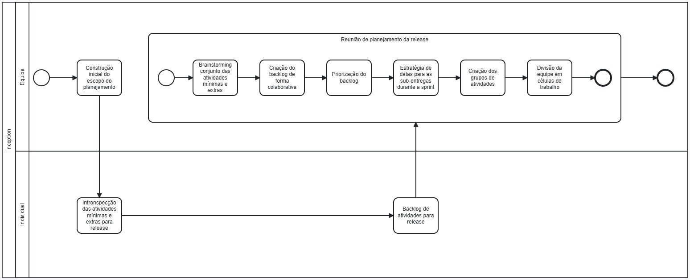
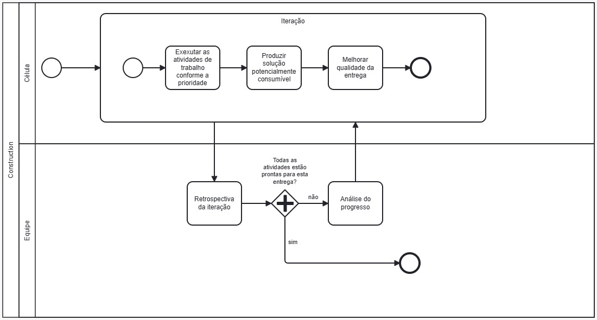
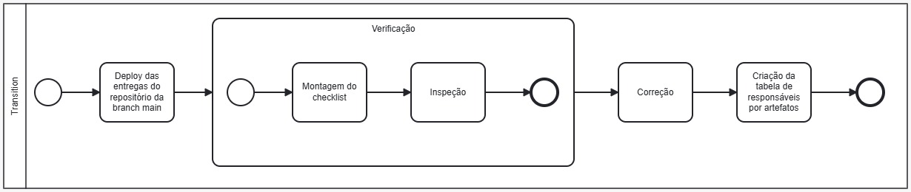
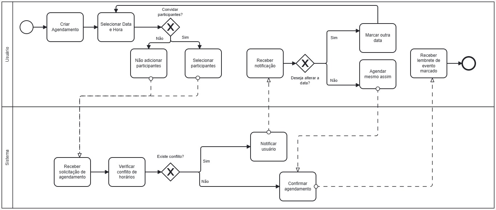

# 1.3. Módulo Modelagem BPMN

## 1.3.1. Processo de Escolha da Metodologia de Trabalho com Disciplined Agile

Para definir a metodologia de trabalho mais adequada para o nosso grupo, utilizamos o *Disciplined Agile* (DA), um framework que ajuda as equipes a identificar a abordagem ágil mais apropriada para seu contexto. O DA fornece ferramentas para equilibrar e adaptar as práticas ágeis, Lean e DevOps de acordo com as necessidades específicas de cada equipe.

## 1.3.2. Etapas do Processo de Escolha

### 1.3.2.1. Análise do Contexto do Grupo

Utilizamos o gráfico de radar do DA para mapear várias dimensões que influenciam na escolha da metodologia:
- **Complexidade do Domínio (Domain Complexity)**: Avaliamos a complexidade e a velocidade de mudança do nosso domínio de atuação.
- **Tamanho da Equipe (Team Size)**: Consideramos o número de integrantes da nossa equipe, que impacta a estrutura e o tipo de coordenação necessária.
- **Distribuição Geográfica (Geographic Distribution)**: Verificamos o grau de distribuição geográfica da equipe, desde localizações no mesmo prédio até equipes globais.
- **Distribuição Organizacional (Organizational Distribution)**: Analisamos se estamos operando em uma organização única, com parceiros de coalizão ou múltiplas entidades.
- **Disponibilidade de Habilidades (Skill Availability)**: Avaliamos a facilidade de acesso às habilidades técnicas e de domínio necessárias para o projeto.
- **Complexidade da Solução (Solution Complexity)**: Identificamos a complexidade da solução e a presença de sistemas legados.
- **Compliance (Conformidade)**: Consideramos os requisitos de conformidade que podem afetar o desenvolvimento.

Essas variáveis foram plotadas no gráfico de radar na Figura 1.3.2.1, permitindo uma visualização clara do perfil do nosso grupo.

**Figura 1.3.2.1. - Gráfico de radar do *Disciplined Agile*. Fonte: PMI**

### 1.3.2.2. Caminho de Decisão do Disciplined Agile

Com base no caminho de decisão do DA, respondemos a uma série de perguntas para guiar nossa escolha:
- **Há uma pessoa para coordenar o fluxo de trabalho?** Se sim, consideramos metodologias que enfatizam a coordenação ativa.
- **O projeto é exploratório?** Identificamos se nosso projeto é de caráter exploratório ou programático.
- **Precisamos de um alto nível de alinhamento?** Verificamos a necessidade de alinhamento entre as equipes, o que influenciou na escolha de frameworks que suportam maior colaboração.
- **É necessária uma entrega contínua?** A entrega contínua foi considerada como um fator importante para projetos que demandam atualizações frequentes.

A partir das respostas, identificamos os fluxos sugeridos pelo DA mostrados na figura 1.3.2.2. abaixo, que nos orientaram na escolha da abordagem final.

**Figura 1.3.2.2. - FLuxo de escolha da metodologia do *Disciplined Agile*. Fonte: PMI**

### 1.3.2.3. Seleção da Metodologia

Com a análise das dimensões de contexto e o caminho de decisão, identificamos que a metodologia mais adequada para nosso grupo é a metodologia ágil. Essa abordagem atende às necessidades de nosso projeto em termos de agilidade, colaboração e entrega de valor.

Dessa forma, utilizamos a metodologia Disciplined Agile Delivery (DAD) como estrutura principal para o desenvolvimento do projeto, devido à sua adaptabilidade e foco em entregar valor contínuo de maneira organizada e eficiente. Estruturamos o projeto em três fases principais — Inception, Construction e Transition — para gerenciar o ciclo de desenvolvimento com clareza e alinhamento às necessidades dos stakeholders. A figura 1.3.2.3 mostra esta estrutura:

**Figura 1.3.2.3. - *Disciplined Agile Delivery (DAD)*. Fonte: PMI**

A partir dessa escolha, o próximo passo será o desenvolvimento do BPMN (Business Process Model and Notation), que formalizará os fluxos e atividades definidos com a metodologia selecionada. A utilização do DA nos permite adaptar o BPMN para refletir de forma precisa a realidade do nosso grupo, garantindo uma gestão de processos mais eficaz e uma entrega de valor contínua ao cliente.

## 1.3.3. Desenvolvimento dos BPMNs

### 1.3.3.1. Metodologia - Inception

Nessa fase, o objetivo foi definir os requisitos essenciais do projeto e entender profundamente o contexto e as necessidades dos clientes e usuários. Utilizamos essa etapa para esclarecer o escopo, estabelecer metas e garantir que a equipe estivesse alinhada em relação aos objetivos e desafios do projeto, conforme o BPMN da figura 1.3.2.4:

**Figura 1.3.2.4. - BPMN Inception**

### 1.3.3.2. Metodologia - Construction

Na fase de construção, focamos no desenvolvimento iterativo e incremental, aplicando práticas ágeis e Lean para maximizar a produtividade e minimizar desperdícios. Trabalhamos com sprints curtos, priorizando a entrega de incrementos funcionais do software que pudessem ser avaliados pelos stakeholders, permitindo ajustes constantes com base no feedback, conforme o BPMN da figura 1.3.2.5:

**Figura 1.3.2.5. - BPMN Construction.**

### 1.3.3.3. Metododologia - Transition

Na fase de transição, nossa equipe concentrou-se em preparar o sistema para a produção. Isso incluiu atividades de integração, testes finais e ajustes, bem como o treinamento de usuários e a criação de documentação. Garantimos que o software estivesse pronto para ser utilizado de maneira eficiente e segura pelos usuários finais, conforme o BPMN da figura 1.3.2.6:

**Figura 1.3.2.6. - BPMN Transition**

### 1.3.3.4. Fluxo de Agendamento

Além dos BPMNs que descrevem as fases da metodologia utilizada no projeto, também foi feito um BPMN representando a atividade de agendamento. O BPMN do fluxo de agendamento foi desenvolvido para representar o processo de agendamento de eventos e compromissos de maneira visual e intuitiva. Esse diagrama descreve as etapas e interações envolvidas desde a solicitação de agendamento até a confirmação, garantindo que todas as partes interessadas estejam coordenadas e que os passos sejam seguidos de forma clara e eficiente, conforme mostra a figura 1.3.2.7 abaixo:

**Figura 1.3.2.7. - Fluxo de Agendamento**

## 1.3.4. Observações

**Foco_3**: Modelagem na Notação BPMN.

**Entrega Mínima**: Modelagem BPMN, orientando-se por uma abordagem metodológica à escolha da equipe (por exemplo, combinação de práticas do Scrum & XP).

**Apresentação** (em sala) explicando o detalhamento metodológico desenhado como um modelo em BPMN, com:
- (i) rastro claro aos membros participantes (MOSTRAR QUADRO DE PARTICIPAÇÕES & COMMITS);
- (ii) justificativas & senso crítico sobre as escolhas metodológicas adotadas para o projeto;
- (iii) comentários gerais sobre o trabalho em equipe.

**Tempo da Apresentação**: +/- 5min. Recomendação: Apresentar diretamente via Wiki ou GitPages do Projeto. Baixar os conteúdos com antecedência, evitando problemas de internet no momento de exposição nas Dinâmicas de Avaliação.

A Wiki ou GitPages do Projeto deve conter um tópico dedicado ao Módulo Modelagem BPMN, com modelagem BPMN (viés metodológico), histórico de versões, referências, e demais detalhamentos gerados pela equipe nesse escopo.

Demais orientações disponíveis nas Diretrizes (vide Moodle).
