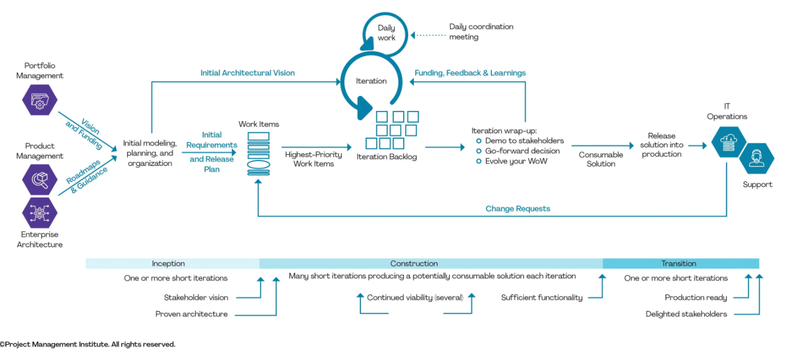

## Etapas do Processo de Escolha

### Análise do Contexto do Grupo

Utilizamos o gráfico de radar do DA para mapear várias dimensões que influenciam na escolha da metodologia:
- **Complexidade do Domínio (Domain Complexity)**: Avaliamos a complexidade e a velocidade de mudança do nosso domínio de atuação.
- **Tamanho da Equipe (Team Size)**: Consideramos o número de integrantes da nossa equipe, que impacta a estrutura e o tipo de coordenação necessária.
- **Distribuição Geográfica (Geographic Distribution)**: Verificamos o grau de distribuição geográfica da equipe, desde localizações no mesmo prédio até equipes globais.
- **Distribuição Organizacional (Organizational Distribution)**: Analisamos se estamos operando em uma organização única, com parceiros de coalizão ou múltiplas entidades.
- **Disponibilidade de Habilidades (Skill Availability)**: Avaliamos a facilidade de acesso às habilidades técnicas e de domínio necessárias para o projeto.
- **Complexidade da Solução (Solution Complexity)**: Identificamos a complexidade da solução e a presença de sistemas legados.
- **Compliance (Conformidade)**: Consideramos os requisitos de conformidade que podem afetar o desenvolvimento.

Essas variáveis foram plotadas no gráfico de radar na Figura 1, permitindo uma visualização clara do perfil do nosso grupo.

 <strong> Figura 1:</Strong> Gráfico de radar do Disciplined Agile <gitbr>

<b>Adaptado por:</b> [Vitor Feijó](https://github.com/vitorfleonardo) & [João Barreto](https://github.com/JoaoBarreto03) & [Paulo Borba](https://github.com/paulohborba), 2024

### Caminho de Decisão do Disciplined Agile

Com base no caminho de decisão do DA, respondemos a uma série de perguntas para guiar nossa escolha:
- **Há uma pessoa para coordenar o fluxo de trabalho?** Se sim, consideramos metodologias que enfatizam a coordenação ativa.
- **O projeto é exploratório?** Identificamos se nosso projeto é de caráter exploratório ou programático.
- **Precisamos de um alto nível de alinhamento?** Verificamos a necessidade de alinhamento entre as equipes, o que influenciou na escolha de frameworks que suportam maior colaboração.
- **É necessária uma entrega contínua?** A entrega contínua foi considerada como um fator importante para projetos que demandam atualizações frequentes.

A partir das respostas, identificamos os fluxos sugeridos pelo DA mostrados na figura 1.3.2.2. abaixo, que nos orientaram na escolha da abordagem final.

 <strong> Figura 2:</Strong> FLuxo de escolha da metodologia do Disciplined Agile <gitbr>

<b>Adaptado por:</b> [Vitor Feijó](https://github.com/vitorfleonardo) & [João Barreto](https://github.com/JoaoBarreto03) & [Paulo Borba](https://github.com/paulohborba), 2024

### Seleção da Metodologia

Com a análise das dimensões de contexto e o caminho de decisão, identificamos que a metodologia mais adequada para nosso grupo é a metodologia ágil. Essa abordagem atende às necessidades de nosso projeto em termos de agilidade, colaboração e entrega de valor.

Dessa forma, utilizamos a metodologia Disciplined Agile Delivery (DAD) como estrutura principal para o desenvolvimento do projeto, devido à sua adaptabilidade e foco em entregar valor contínuo de maneira organizada e eficiente. Estruturamos o projeto em três fases principais — Inception, Construction e Transition — para gerenciar o ciclo de desenvolvimento com clareza e alinhamento às necessidades dos stakeholders. A figura 1.3.2.3 mostra esta estrutura:

 <strong> Figura 3:</Strong> Disciplined Agile Delivery (DAD) <gitbr>

<b>Adaptado por:</b> [Vitor Feijó](https://github.com/vitorfleonardo) & [João Barreto](https://github.com/JoaoBarreto03) & [Paulo Borba](https://github.com/paulohborba), 2024

A partir dessa escolha, o próximo passo será o desenvolvimento do BPMN (Business Process Model and Notation), que formalizará os fluxos e atividades definidos com a metodologia selecionada. A utilização do DA nos permite adaptar o BPMN para refletir de forma precisa a realidade do nosso grupo, garantindo uma gestão de processos mais eficaz e uma entrega de valor contínua ao cliente.

## Bibliografia
><a>1.</a> PROJECT MANAGEMENT INSTITUTE (PMI). Guia do Conhecimento em Gerenciamento de Projetos (Guia PMBOK). 6 ed. Estados Unidos: PMI, 2017.

><a>2.</a> CAMUNDO AG. BPMN.io: A Toolkit for Viewing and Editing BPMN Diagrams. Disponível em: https://bpmn.io/. Acesso em: 03 nov. 2024.

## Histórico de Versão
| Versão | Data | Descrição | Autor(es) | Data de revisão | Revisor(es) |
| :-: | :-: | :-: | :-: | :-: | :-: |
| `1.0` | 02/11/2024  | Versão inicial do artefato. | [João Barreto](https://github.com/JoaoBarreto03) |03/11/2024  | [Vitor Feijó](https://github.com/vitorfleonardo) |
| `1.1` | 03/11/2024  | Escolha da metodologia | [João Barreto](https://github.com/JoaoBarreto03) & [Julia Vitoria](https://github.com/juhvitoria4) & [Yago Passos](https://github.com/yagompassos) & [Vitor Feijó](https://github.com/vitorfleonardo) & [Paulo Borba](https://github.com/paulohborba) |03/11/2024  | [Hugo Melo](https://github.com/melohugo) |
| `1.2` | 03/11/2024  | Padronização dos autores e bibliografias | [João Barreto](https://github.com/JoaoBarreto03) | 03/11/2024  | [Paulo Borba](https://github.com/paulohborba) |