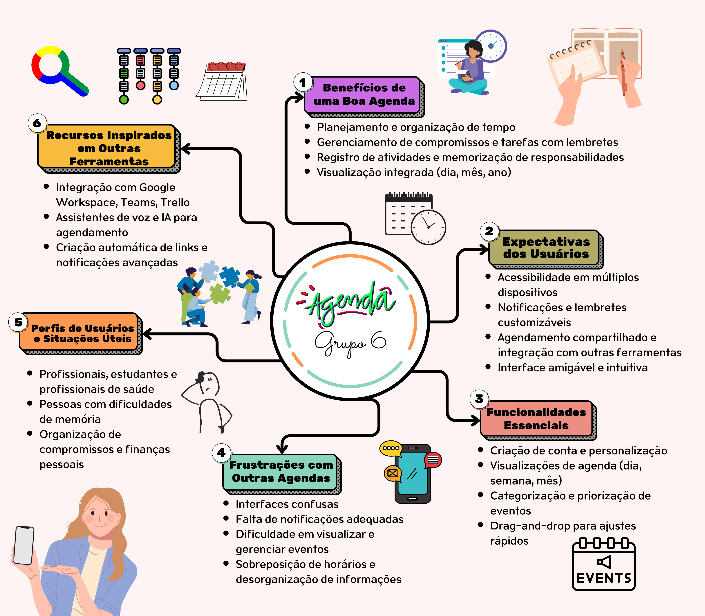

# Artefato: Mapa Mental

## Introdução

O Mapa Mental é uma representação visual de informações e conceitos interligados, estruturados em torno de uma ideia central. É uma ferramenta utilizada para organizar ideias, explorar associações, e facilitar a memorização e compreensão de conteúdos complexos. Desenvolvido para representar graficamente informações, o mapa mental auxilia em diversas atividades, desde estudos e brainstorming até a resolução de problemas e planejamento estratégico.

Por meio de palavras-chave, imagens e ramificações, o mapa mental permite que a estrutura de um tema seja decomposta em subtemas e tópicos, promovendo uma visão holística e intuitiva do conteúdo. Essa técnica é amplamente usada em educação, gerenciamento de projetos e desenvolvimento pessoal.

---

## Mapa mental

Este mapa mental foi criado a partir das ideias geradas no brainstorming realizado na primeira etapa do processo de [Design Sprint](docs/Base/1.1.DesignSprint.md) com toda a equipe. Ele organiza as ideias levantadas, proporcionando uma visão geral dos conceitos explorados e ajudando na definição das próximas etapas do projeto.

<b>Autor:</b>  [Bianca Patrocínio](https://github.com/BiancaPatrocinio7), 2024

---
## Referências

- Buzan, Tony. *Dominando a Técnica dos Mapas Mentais*. São Paulo: Cultrix, 2006. Disponível em [Zoboko](https://zoboko.com/book/6onm8w0q/dominando-a-tecnica-dos-mapas-mentais).

- Eppler, Martin J. "A comparison between concept maps, mind maps, conceptual diagrams, and visual metaphors as complementary tools for knowledge construction and sharing." 5, no. 3 (2006): 202-210. Disponível em [Google Scholar](https://scholar.google.com/).

## Histórico de Versão
| Versão | Data | Descrição | Autor(es) | Data de revisão | Revisor(es) |
| :-: | :-: | :-: | :-: | :-: | :-: |
| `1.0` | 01/11/2024  | Criação do mapa mental. | [Bianca Patrocínio](https://github.com/BiancaPatrocinio7) |  |  |

