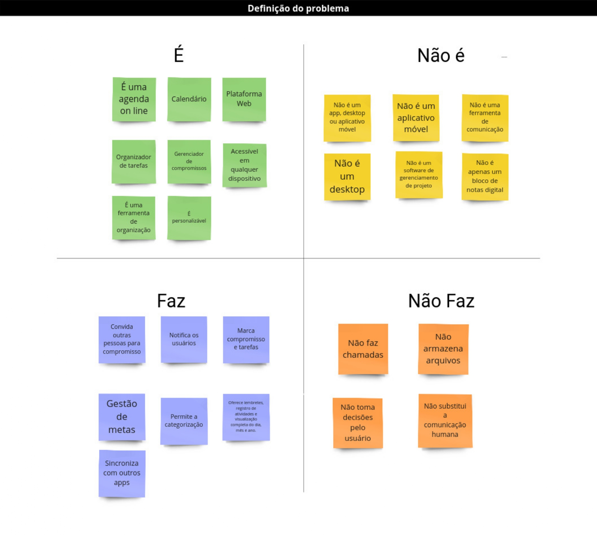
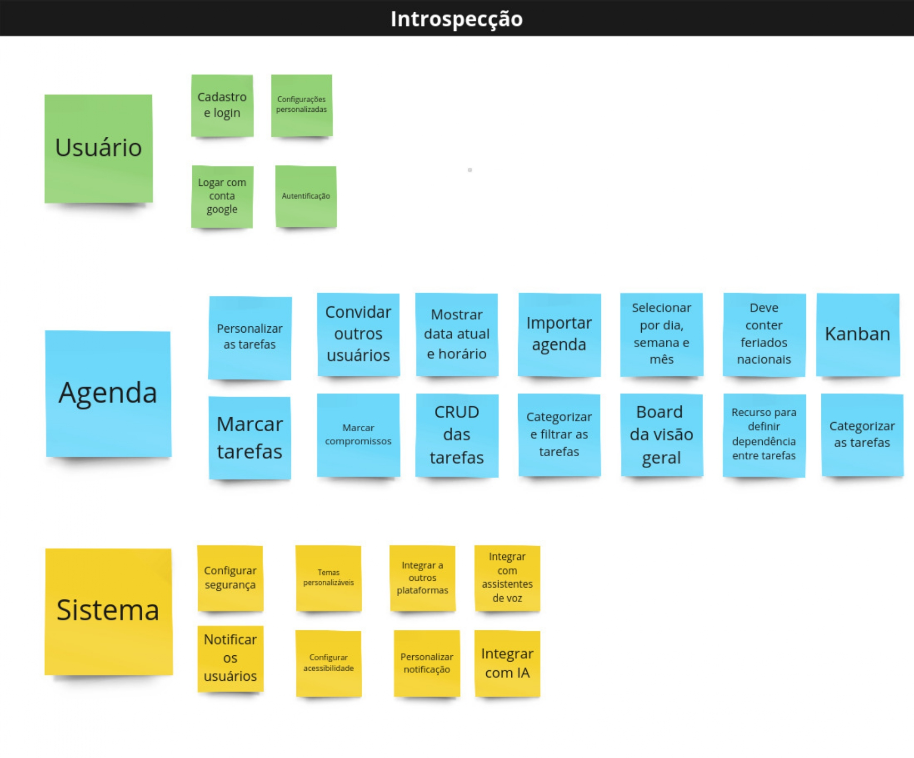
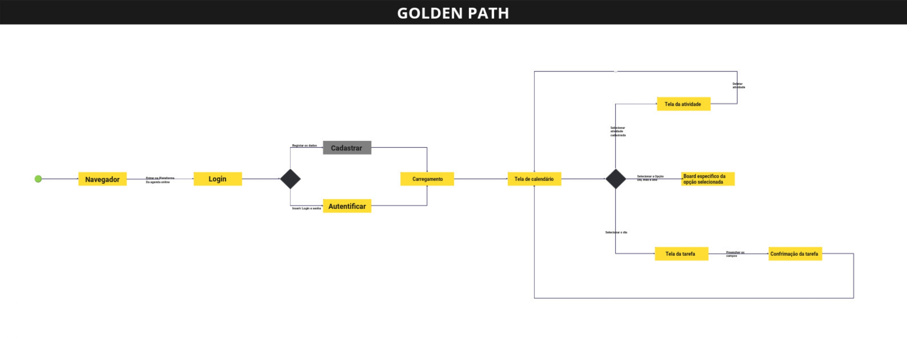

# Define

## Introdução

A fase de "Define" é essencial para clarificar o foco do projeto, estabelecendo uma visão clara e coesa do problema e das metas que irão orientar a equipe ao longo da Sprint. Após a intensa coleta e análise de informações na fase anterior, é comum que o problema inicial pareça amplo ou até vago. A fase de definição ajuda a afunilar essas informações, permitindo que a equipe direcione seus esforços ao que realmente importa, garantindo um foco bem delimitado.

Outro propósito central dessa fase é a definição do objetivo de Sprint. Esse objetivo atua como um guia central para toda a equipe, deixando claro o que se espera alcançar ao final do processo. Com o objetivo de Sprint bem definido, a equipe tem uma referência sólida para se manter alinhada e evitar distrações ou desvios no decorrer das próximas etapas.

Além disso, a fase de "Define" busca identificar métricas de sucesso, ou seja, estabelecer como será possível medir o impacto e a efetividade da solução desenvolvida. Definir essas métricas é importante, pois permite que a equipe saiba se está no caminho certo, podendo ajustar as direções de trabalho caso seja necessário. Essa clareza sobre como medir o sucesso oferece uma base objetiva para a avaliação dos resultados e do impacto do projeto.

## É-Não É-Faz-Não Faz

Técnica definida em [É-Não É-Faz-Não Faz](../1.1.DesignSprint.md#É-Não-É-Faz-Não-Faz)

Para iniciar a segunda etapa da Design Sprint, a equipe utilizou a técnica "É-Não É-Faz-Não Faz". Essa técnica foi essencial para definir o escopo e o propósito do produto, ajudando a estabelecer o que ele será e fará, e também o que não será e não fará. Esse exercício proporcionou uma visão alinhada entre os membros da equipe, eliminando ambiguidades e garantindo que todos entendessem os limites e as funcionalidades essenciais do produto desde o início.

    

<b>Autor:</b>  [Carlos Eduardo](https://github.com/CADU110), [Hugo Queiroz](https://github.com/melohugo) e [Ricardo Augusto](https://github.com/avmricardo), 2024

## Success Metrics & Signals

Técnica definida em [Success Metrics & Signals](../1.1.DesignSprint.md#success-metrics-amp-signals&-Signals)

A equipe escolheu a técnica de Success Metrics & Signals para definir critérios claros de sucesso para o produto, essenciais para avaliar se as soluções em desenvolvimento vão atender aos objetivos definidos. Essa técnica permitiu estabelecer métricas específicas que indicariam o impacto do produto e os sinais que revelariam seu progresso em direção aos resultados esperados.

## Engajamento

### Métricas de engajamento

- **Ativação:** Número de usuários que completam o cadastro e adicionam sua primeira tarefa.
- **Usuários Ativos Diários/Mensais:** Número de usuários que acessam a agenda diariamente/mensalmente.
- **Tarefas Criadas por Usuário:** Número médio de tarefas criadas por usuário por semana/mês.

### Sinais de Sucesso de engajamento

- Aumento no número de usuários ativos.
- Alta taxa de criação de tarefas.
- Utilização consistente dos recursos da agenda.

## Retenção

### Métricas de retenção

- **Taxa de Retenção:** Porcentagem de usuários que continuam utilizando a agenda após um período determinado.

### Sinais de Sucesso de retenção

- Alta taxa de retenção.

## Satisfação

### Métricas de satisfação

- **Net Promoter Score (NPS):** Mede a probabilidade dos usuários recomendarem a agenda para outras pessoas.
- **Pesquisas de Satisfação:** Feedback direto dos usuários sobre a experiência com a agenda.

### Sinais de Sucesso de satisfação

- Alto NPS.
- Boas avaliações nos sites de avaliação.
- Feedback positivo nas pesquisas de satisfação.

<b>Autor:</b>  [Carlos Eduardo](https://github.com/CADU110) e [Hugo Queiroz](https://github.com/melohugo), 2024

## Introspecção

Técnica definida em [Introspecção](../1.1.DesignSprint.md#Introspecção)

A equipe utilizou a técnica de Introspecção para refletir sobre as ideias e decisões tomadas até o momento, promovendo uma análise sobre os aspectos do projeto. Essa etapa foi importante porque permitiu que os membros processasse as informações e insights ajudando a identificar perspectivas ou preocupações que poderiam ter passado despercebidas durante as discussões em grupo. A introspecção também ofereceu um momento para avaliar se as direções escolhidas realmente faziam sentido para o objetivo final.

    

<b>Autor:</b>  [Carlos Eduardo](https://github.com/CADU110), [Hugo Queiroz](https://github.com/melohugo) e [Ricardo Augusto](https://github.com/avmricardo), 2024

## Design Principles

Técnica definida em [Design Principles](../1.1.DesignSprint.md#Design-Principles)

A equipe adotou a técnica de Design Principles para definir princípios norteadores que orientassem o desenvolvimento do produto e ajudassem a manter a consistência nas decisões de design. Esses princípios foram estabelecidos com base nas necessidades dos usuários e nos objetivos do projeto, funcionando como diretrizes para garantir que as soluções propostas fossem alinhadas com os valores e propósitos centrais do produto.

1. **Simplicidade e Clareza:**
   - **Interface intuitiva:** Facilidade de navegação e compreensão, livre de elementos desnecessários.
   - **Visualização clara:** Priorização das informações essenciais, como data, hora e título do evento.
   - **Hierarquia visual:** Uso de cores, tamanhos e espaçamento para guiar o usuário pelas informações mais importantes.

2. **Personalização e Flexibilidade:**
   - **Temas e cores:** Opções para personalizar a aparência da agenda, adaptando-a ao gosto do usuário.
   - **Configurações de visualização:** Opções para ajustar a exibição da agenda (dia, semana, mês) e exibir ou esconder informações.
   - **Integração com outras ferramentas:** Possibilidade de conectar a agenda com outras plataformas para otimizar o fluxo de trabalho.

3. **Funcionalidade e Eficiência:**
   - **Agendamento rápido e fácil:** Interface amigável para criar, editar e remover eventos.
   - **Lembretes e notificações eficazes:** Configurações personalizadas para alertar o usuário sobre eventos importantes.
   - **Opções de compartilhamento e colaboração:** Facilidade para compartilhar eventos e agendas com outros usuários.

4. **Acessibilidade e Inclusão:**
   - **Design responsivo:** Ajuste automático da interface para diferentes dispositivos (computadores, tablets, smartphones).
   - **Acessibilidade para usuários com deficiência:** Atender aos padrões de acessibilidade para garantir a experiência de todos os usuários.
   - **Linguagem clara e concisa:** Utilização de uma linguagem simples e fácil de entender, evitando termos técnicos.

5. **Estética e Elegância:**
   - **Interface visualmente agradável:** Utilização de cores, fontes e imagens que transmitam profissionalismo e modernidade.
   - **Minimalismo:** Foco nos elementos essenciais, evitando sobrecarga visual.
   - **Design responsivo:** Ajuste automático da interface para diferentes tamanhos de tela.

<b>Autor:</b>  [Carlos Eduardo](https://github.com/CADU110) e [Hugo Queiroz](https://github.com/melohugo), 2024

## Golden Path

Técnica definida em [Golden Path](../1.1.DesignSprint.md#Golden-Path)

A equipe utilizou a técnica do Golden Path para mapear o "caminho de ouro" da experiência do usuário, ou seja, o fluxo ideal que um usuário seguiria ao interagir com o produto para alcançar seus objetivos de forma simples e eficiente. Essa técnica foi essencial para identificar o percurso central e sem complicações que o usuário deveria seguir, ajudando a equipe a priorizar funcionalidades e garantir uma experiência fluida.

    

<b>Autor:</b>  [Carlos Eduardo](https://github.com/CADU110) e [Hugo Queiroz](https://github.com/melohugo), 2024

## Requisitos Elicitados

| ID    | Requisito                                                                              |
|:-:|:-:|
| REQ01 | Cadastro e login de novos usuários.                                                    |
| REQ02 | Personalização das configurações de usuário (temas, notificações, idioma, etc.).      |
| REQ03 | Login com conta do Google.                                                             |
| REQ04 | Criação e edição de eventos e tarefas.                                                |
| REQ05 | Personalização de tarefas (prioridades, prazos, datas de vencimento, etiquetas, etc.). |
| REQ06 | Visualização da agenda (diário, semanal, mensal, anual, lista).                       |
| REQ07 | Filtros e buscas avançadas (palavras-chave, categorias, datas, etc.).                 |
| REQ08 | Lembretes personalizados para eventos e tarefas.                                      |
| REQ09 | Categorização de tarefas e eventos.                                                   |
| REQ10 | Recurso de arrastar e soltar para reorganizar tarefas e eventos.                      |
| REQ11 | Compartilhamento de agendas com outros usuários (com níveis de permissão).             |
| REQ12 | Envio de convites para eventos.                                                       |
| REQ13 | Sincronização com calendários externos (Google Calendar, Outlook Calendar, etc.).     |
| REQ14 | Integração com assistentes de voz (Google Assistant, Siri, Alexa).                    |
| REQ15 | Integração com plataformas de email.                                                  |
| REQ16 | Definição de dependências entre tarefas.                                               |
| REQ17 | Inclusão de feriados nacionais.                                                        |
| REQ18 | Visualização Kanban ou To-Do List para tarefas diárias.                               |
| REQ19 | Sincronização com diversos dispositivos (mobile, desktop, web).                        |

## Histórico de Versão

| Versão | Data | Descrição | Autor(es) | Data de revisão | Revisor(es) |
| :-: | :-: | :-: | :-: | :-: | :-: |
| `1.0` | 01/11/2024  | Versão inicial do artefato. | [Hugo Queiroz](https://github.com/melohugo) |03/11/2024  | [Bianca Castro](https://github.com/BiancaPatrocinio7) |
| `1.1` | 03/11/2024  | Arrumando caminho das imagens e adicionando histórico| [Bianca Castro](https://github.com/BiancaPatrocinio7) | |   |
