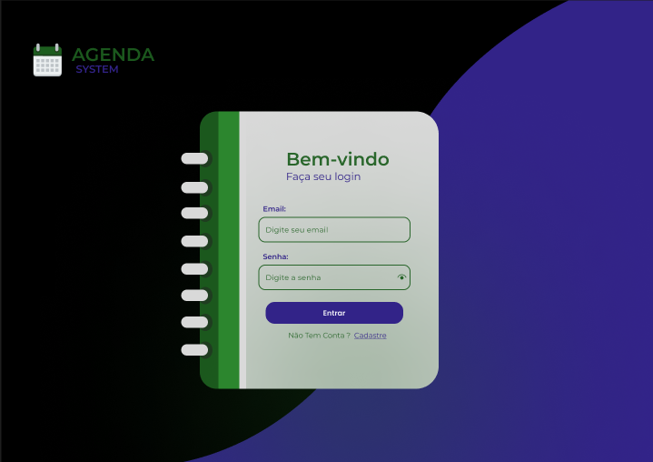
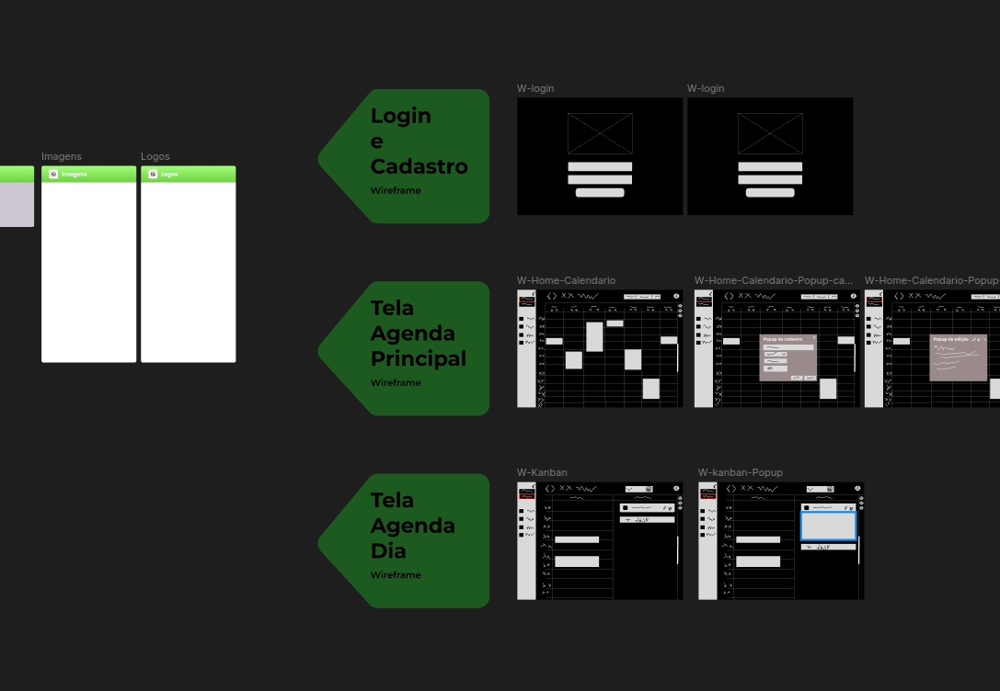
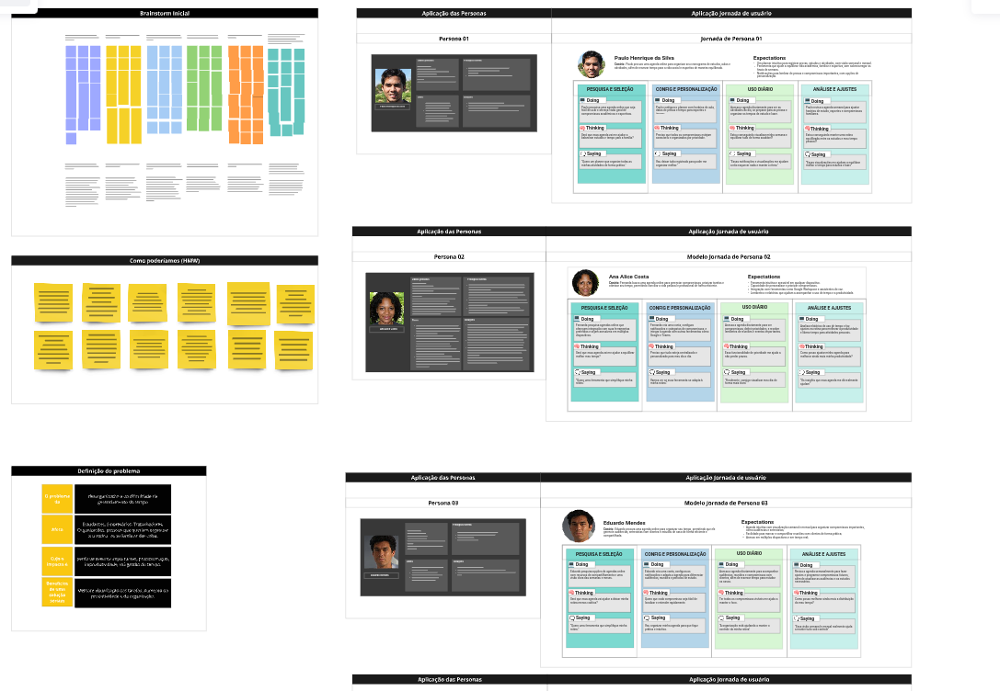
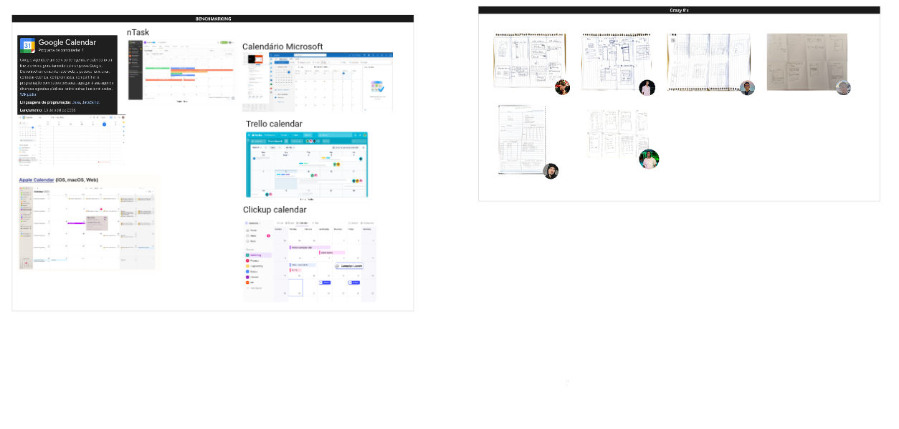
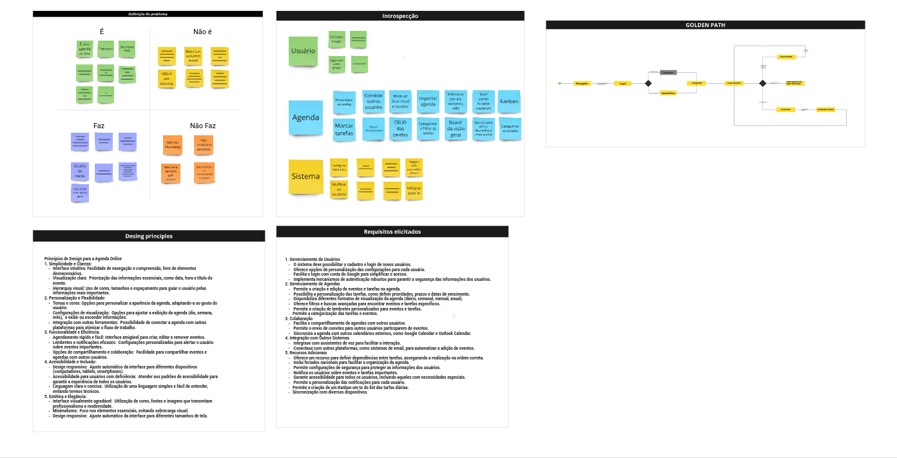

# G6_Agenda

**Código da Disciplina**: FGA0208  
**Número do Grupo**: 6  
**Entrega**: 01  

## Alunos

|Matrícula | Aluno |
| -- | -- |
| 22/1008801  |  Bianca Patrocínio Castro |
| 22/1022248  |  Carlos Eduardo Mota Alves |
| 20/2016266  |  Gariel Marques De Souza |
| 22/1008060  |  Gabriel Moura Dos Santos |
| 21/1039312  |  Danilo Carvalho Antunes |
| 22/1021993  |  Hugo Queiroz Camelo De Melo |
| 21/1039519  |  João Manoel Barreto Neto |
| 19/0110066  |  Johnny da Ponte Lope |
| 21/1031083  |  Julia Vitoria Freire Silva |
| 19/0094273  |  Paulo Henrique Rossi de Borba |
| 18/0077899  |  Ricardo Augusto Valle Maciel |
| 22/1008516  |  Vitor Feijó Leonardo |
| 20/0049879  |  Yago Milagres Passos |

## Sobre

Uma agenda digital eficiente pode transformar a organização do dia a dia, promovendo produtividade e melhorando a gestão de compromissos. Ferramentas como o [Google Calendar](https://calendar.google.com), que oferece sincronização em tempo real e lembretes personalizados, ajudam os usuários a manterem-se organizados em diferentes dispositivos. Outros exemplos incluem o [Trello](https://trello.com), que utiliza uma interface visual intuitiva com funcionalidade de arrastar e soltar para organizar tarefas e projetos, e o [Microsoft Teams](https://www.microsoft.com/pt-br/microsoft-teams), que permite integrar agendas e eventos para facilitar a colaboração em equipes. Essas referências mostram como a integração e a personalização são essenciais para uma agenda que atenda bem às expectativas dos usuários.

## Screenshots da Primeira Entrega

    
    

    
    

    
    

## Há algo a ser executado?

( ) SIM

(X) NÃO

## Informações Complementares

Quaisquer outras informações adicionais podem ser descritas nessa seção.

## Histórico de Versão

| Versão | Data | Descrição | Autor(es) | Data de revisão | Revisor(es) |
| :-: | :-: | :-: | :-: | :-: | :-: |
| `1.0` | 03/11/2024  | Versão inicial do artefato. | [Bianca Castro](https://github.com/BiancaPatrocinio7) | 03/11/2024 | [Vitor Feijó](https://github.com/vitorfleonardo) |
